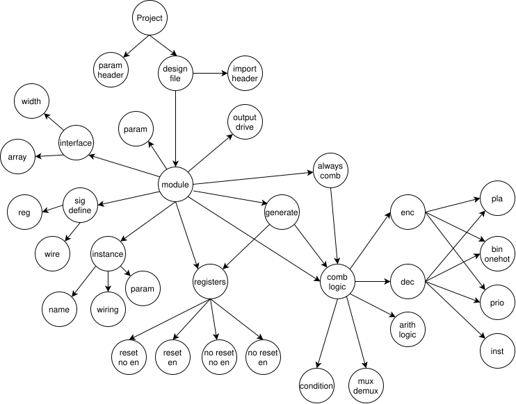

# RTL Traverse
不是代码驱动 Graph，而是 Graph 驱动代码理解
```
           ┌────────────────────┐
           │   Semantic Atom    │
           │     Graph (VHSG)   │◄─────────────┐
           └────────────────────┘              │
                     ▲                         │
                     │ semantic binding        │
                     │                         │
┌────────────┐  guided traversal       ┌───────┴────────┐
│  Verilog   │ ──────────────────────► │   LLM Agent    │
│  Source    │   (ROOT → while/case)   │ (Reasoning)    │
└────────────┘                         └────────────────┘
                     │
                     ▼
           Source → Atom Attribution Map
```

## Verilog HW Semantic Graph


## Integrity
直至每行代码都能够追溯到这个树的 node

## Methodology
### Code Slice
Python 负责 所有“不能出错”的事情：
* 源码切片（Line / Block / Always 分组）
* 代码拆分（Normalization）
* 构建 Source Location Index

示例
```
SourceSpan = {
  "file": "ifu.v",
  "start_line": 123,
  "end_line": 141,
  "text": "always_ff @(posedge clk)..."
}
```

### LLM Labelling
LLM 负责：
* 判断 “这段代码在语义上属于哪个 Atom”
* 决定 是否需要拆分
* 决定 如何拆分（按语义，而非语法）

设计初期每次拆分都必须人类协作

### Traverse
```
FOR each ROOT in VHSG:
  SET context = ROOT.semantic_role
  WHILE unbound source exists:
    SELECT source span relevant to current node
    ASK LLM:
      - Does this span implement this semantic?
      - Does it need splitting?
    UPDATE Graph
    UPDATE SourceAttribution
```

不是“看完整个文件”

而是 “按语义责任区块推进”

